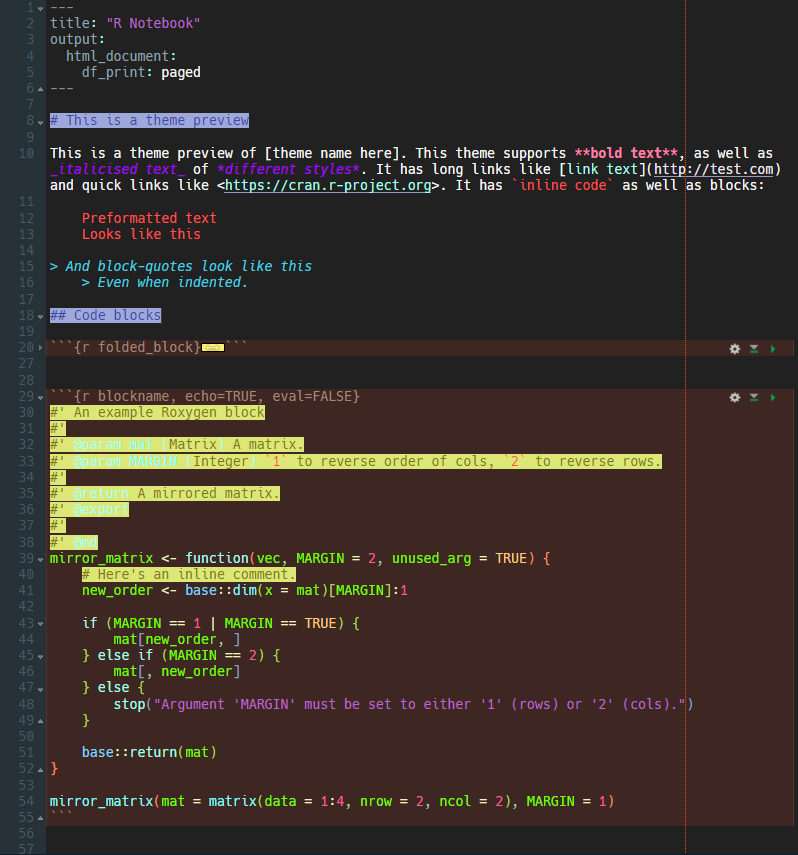

# RStudioThemeTemplate

This is a SASS template for making custom RStudio themes, including editor syntax highlighting. It has the most complete support for syntax highlighting that I've yet seen.

To actually use the theme template, click the big **Use this Template** button at the top-right of this pane and make your own copy of it. 

Install [SASS](sass-lang.com/) and compile the `.sass` file to a `.rstheme` file with

    sass --watch "Template_Dark.sass" "C:\Program Files\RStudio\resources\app\resources\themes\Template_Dark.rstheme"
    
And set it as your theme in RStudio. To reflect any new changes, right-click in RStudio and select Reload.

PS. You can quickly clear out the preset colours by doing a regex find replace: `#.{6}` → `inherit`.

## Features

- Only has style selectors that actually do something, gleaned from long and painful element inspection in RStudio
- Properly separates syntax highlighting from Markdown highlighting/styles
- Exposes rainbow brackets and rainbow indent guides

## Limitations of RStudio/ACE editor

- You can't have text elements of different sizes; it makes the visual cursor no longer point to where the cursor actually is.
- Same for editing the padding and margins of elements too much, it makes the cursor misaligned with the real cursor position.
- Basically all items are spans and display inline. Many elements *can* be made to `display: block`, but it can have unintended effects. For example, styling the first and last line of code chunks as `display: block` means that you can have code blocks that are fully surrounded by a border or book-ended with a different colour background, but it also means that these items will fold into three separate lines instead of folding down to one line.
- The Terminal pane is a bit of a bother. The styles dedicated to its colours take up 500+ lines, so they're in a separate file that gets `@import`ed. I haven't exposed any of the terminal's colours as variables because it was way too easy to accidentally make it unusable.

## Theme preview

These colours weren't chosen to be pleasing, they were chosen to show that nearly everything can be styled in this template.

## Variable dictionary (things you can edit out-of-the-box)

If anything isn't already here, just add it yourself. 

| Variable name           | User interface                           | R syntax                                                    | Rmarkdown elements                  | Notes                                                                                                    |
|-------------------------|------------------------------------------|-------------------------------------------------------------|-------------------------------------|----------------------------------------------------------------------------------------------------------|
| $base_text_clr          |                                          |                                                             | Regular text                        |                                                                                                          |
| $whitespace_clr         |                                          | Whitespace, if 'Show whitespace characters' is enabled.     |                                     | Spaces and EOLs can be separately styled, but I did not include that in   this template.                 |
| $cursor_clr             | Text cursor                              |                                                             |                                     |                                                                                                          |
| $editor_bg              | Background of all panes                  |                                                             |                                     | Editable panes (Editor, Console, Render) and non-editable panes (all   others) can be styled separately. |
| $activeline_bg          | Active line highlight, if enabled.       |                                                             |                                     |                                                                                                          |
| $activeline_bdr         | Active line highlight, if enabled.       |                                                             |                                     |                                                                                                          |
| $debugline_bg           | Active line in debugger                  |                                                             |                                     |                                                                                                          |
| $codechunk_bg           |                                          |                                                             | Rmarkdown code chunks               | First and last line of code chunks can be styled separately.                                             |
| $codechunk_bdr          |                                          |                                                             | Rmarkdown code chunks               |                                                                                                          |
| $codechunk_clr          |                                          |                                                             | Rmarkdown code chunks               |                                                                                                          |
| $fold_clr               | Folded block indicator                   |                                                             |                                     |                                                                                                          |
| $gutter_bg              | Gutter background                        |                                                             |                                     |                                                                                                          |
| $gutter_clr             | Line number colour                       |                                                             |                                     |                                                                                                          |
| $active_selection_bg    | Active selection                         |                                                             |                                     |                                                                                                          |
| $active_selection_bdr   | Active selection                         |                                                             |                                     |                                                                                                          |
| $inactive_selection_bg  | Inactive selection (e.g. matching words) |                                                             |                                     |                                                                                                          |
| $inactive_selection_bdr | Inactive selection (e.g. matching words) |                                                             |                                     |                                                                                                          |
| $ruler_bdr              | Line length ruler                        |                                                             |                                     |                                                                                                          |
| $matching_bdr           |                                          | Matching bracket                                            |                                     |                                                                                                          |
| $invalid_clr            |                                          | Undisplayable characters (e.g. Unicode chars in ASCII file) |                                     |                                                                                                          |
| $invalid_bg             |                                          | Undisplayable characters (e.g. Unicode chars in ASCII file) |                                     |                                                                                                          |
| $comment_clr            |                                          | Comments and Roxygen blocks                                 |                                     |                                                                                                          |
| $comment_bg             |                                          | Comments and Roxygen blocks                                 |                                     |                                                                                                          |
| $keyword_clr            |                                          | if, else, stop, etc.                                        |                                     |                                                                                                          |
| $function_clr           |                                          | Function names, if 'Highlight R function calls' enabled     |                                     |                                                                                                          |
| $package_clr            |                                          | Package names to the left of ::                             |                                     |                                                                                                          |
| $operator_clr           |                                          | <- = > etc.                                                 |                                     |                                                                                                          |
| $infix_clr              |                                          | %in% %>% etc.                                               |                                     |                                                                                                          |
| $comma_clr              |                                          | Commas can be specifically styled, for some reason.         |                                     |                                                                                                          |
| $constant_clr           |                                          | TRUE, FALSE, NA, NULL                                       |                                     |                                                                                                          |
| $numeric_clr            |                                          | Integers and Numeric                                        |                                     |                                                                                                          |
| $string_clr             |                                          | Strings                                                     |                                     |                                                                                                          |
| $var_arg_clr            |                                          | Variable names and argument names                           |                                     | Sadly, variable names and argument names cannot be styled separately.                                    |
| $yamlkey_clr            |                                          |                                                             | YAML keys e.g. `title:`             |                                                                                                          |
| $code_clr               |                                          |                                                             | Backticked and indented code blocks |                                                                                                          |
| $bold_clr               |                                          |                                                             | Bold text                           |                                                                                                          |
| $italic_clr             |                                          |                                                             | Italicised text                     |                                                                                                          |
| $heading_clr            |                                          |                                                             | Headings of all levels              |                                                                                                          |
| $heading_bg             |                                          |                                                             | Headings of all levels              |                                                                                                          |
| $url_clr                |                                          |                                                             | Web addresses                       |                                                                                                          |
| $blockquote_clr         |                                          |                                                             | Blockquotes                         |                                                                                                          |
| $help_link_clr          | In Help pane, colour of link text.       |                                                             |                                     |                                                                                                          |
| $help_link_bg           | In Help pane, background of link text.   |                                                             |                                     |                                                                                                          |
| $indent_guide_bdr       | "Grey lines" style indent guide          |                                                             |                                     |                                                                                                          |
| $rainbow0               | Rainbow indent                           | Rainbow brackets                                            |                                     | Rainbow indent styles (lines vs fill) and rainbow brackets can all be   styled separately.               |
| $rainbow1               | Rainbow indent                           | Rainbow brackets                                            |                                     |                                                                                                          |
| $rainbow2               | Rainbow indent                           | Rainbow brackets                                            |                                     |                                                                                                          |
| $rainbow3               | Rainbow indent                           | Rainbow brackets                                            |                                     |                                                                                                          |
| $rainbow4               | Rainbow indent                           | Rainbow brackets                                            |                                     |                                                                                                          |
| $rainbow5               | Rainbow indent                           | Rainbow brackets                                            |                                     |                                                                                                          |
| $rainbow6               | Rainbow indent                           | Rainbow brackets                                            |                                     |                                                                                                          |

## Licensing

This is under the Unlicense and dedicated to the public domain. It would be nice if you gave this project credit if you used it so that others could use it too.
